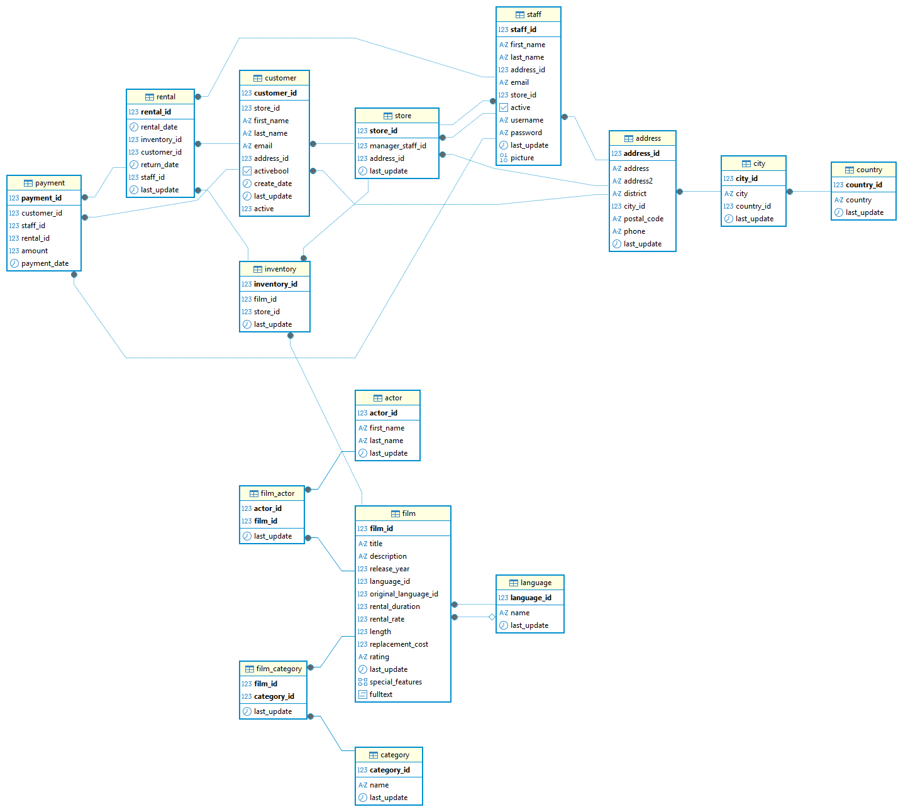

# 📽️ Proyecto SQL: Tienda de Películas  
##  📌 Introducción
Desarrollo del proyecto de Consultas con SQL.
Este proyecto forma parte del curso de **Data Analytics** y consiste en la realización de un conjunto de consultas SQL sobre una base de datos proporcionada de una tienda de películas ficticia.

El **objetivo** del proyecto es demostrar las habilidades adquiridas en **SQL** y en el uso de herramientas como **PostgreSQL** **DBeaver**, extrayendo información relevante de la base de datos.

## 🗂️ Estructura del Proyecto

## 🛠️ Herramientas Utilizadas
- **Lenguaje**: SQL (PostgreSQL).
- **Entorno**: DBeaver.

## 🏗️ Modelo de Datos

## 🔍 Consultas Realizadas

## 📈 Resultados y Aprendizajes
- Uso de **SELECT, JOIN, GROUP BY, ORDER BY y funciones de agregación**.  
- Aplicación de **subconsultas y CTEs**.
- Interpretación de resultados en un **contexto de negocio realista**.

## ✨ Próximos Pasos
