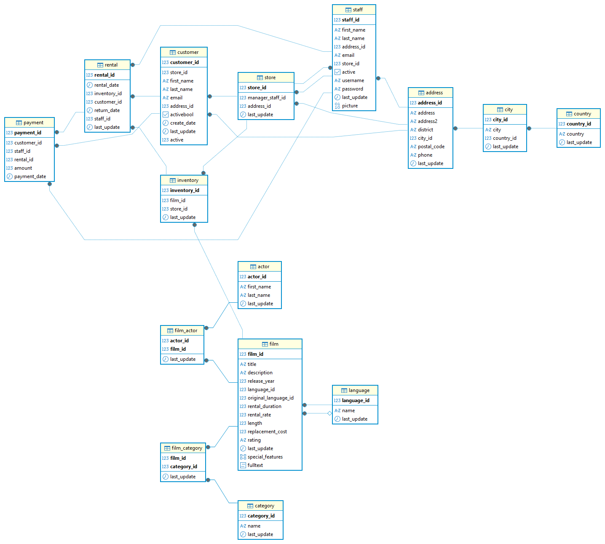

# 📽️ Proyecto SQL: Tienda de Películas  
##  📌 INTRODUCCIÓN
Desarrollo del proyecto de Consultas con SQL.
Este proyecto forma parte del curso de **Data Analytics** y consiste en la realización de un conjunto de consultas SQL sobre una base de datos proporcionada de una tienda de películas ficticia.

El **objetivo** del proyecto es demostrar las habilidades adquiridas en **SQL** y en el uso de herramientas como **PostgreSQL** **DBeaver**, extrayendo información relevante de la base de datos.

## 🗂️ ESTRUCTURA DEL PROYECTO
```
📂 Dashboard_Airbnb_Excel
├── BBDD_Proyecto.sql                      # Archivo sql de la base de datos empleada en el proyecto
├── ConsultasProyecto.sql                  # Archivo sql con las consultas realizadas en el proyecto.
├── EnunciadoDataProject_SQL.Lógica.pdf    # Archivo PDF con los enunciados de las consultas a realizar  
├── Esquema_ER_BBDD.png                    # Imagen del esquema Entidad-Relación de la Base de Datos       
└── README.md
```
## 🛠️ HERRAMIENTAS UTILIZADAS
- **Lenguaje**: SQL (PostgreSQL).
- **Entorno**: DBeaver.

## 🏗️ ESQUEMA ER DE LA BASE DE DATOS


### ANÁLISIS DESCRIPTIVO DE LA BBDD
La BBDD corresponde a la información de una tienda de películas, que se puede dividir en tres grandes grupos de información: 
1. Información correspondiente a los clientes (payment, rental, customer)
2. Información correspondiente a las tiendas y sus empleados (store, staff, address, city, country, inventory)
3. Información correspondiente a las propias películas (film, actor, film_actor, film_category, category, languaje).

Estos tres campos se relacionan entre sí mediante distintas tablas que conectan sus parámetros:
- **Film** almacena la información de las películas y se vincula con: 
    - **Inventory**, que contiene las copias disponibles en cada tienda.
    - **Film_actor**, que relaciona las películas con sus actores.
    - **Film_category**, que asigna categorías a cada películas.
    - **Language**, que define el idioma en el que está disponible la película.
- **Inventory** conecta las películas con las tiendas y los registros de alquiler (**Rental**).
- **Rental** guarda el historial de alquileres, relacionando copias de películas (**Inventory**) con clientes (**Customer**), empleados que gestionan el alquiler (**Staff**) y los pagos correspondientes (**Payment**).
- **Payment** registra los cobros de cada alquiler, vinculados a clientes y empleados.
- **Customer** representa a los clientes de la tienda, con relación a sus direcciones (**Address**), sus alquileres (**Rental**) y sus pagos (**Payment**).
- **Store** define las sucursales de la tienda, relacionándose con su inventario (**Inventoy**), empleados (**Staff**) y ubicación (**Address**).
- **Staff** corresponde a los empleados de cada tienda, vinculadores con direcciones, alquileres y pagos que gestionan.
- **Address**, **City** y **Country** forman una jerarquía geográfica para clientes, empleados y tiendas.
- **Actor** se relaciona con las películas a través de **Film_Actor**.
- **Category** se relaciona con las películas a través de **Film_category**.


## 🛠️ METODOLOGÍA Y PASOS SEGUIDOS
1. **Exploración inicial de la base de datos**
   - Revisión del modelo entidad–relación de la base de datos proporcionada.  
   - Identificación de las tablas clave (`film`, `actor`, `rental`, `customer`, `category`, etc.) y sus relaciones.

2. **Plan de trabajo**
   - Resolver cada enunciado de forma independiente.
   - Comenzar con consultas simples (`SELECT`, `WHERE`, `ORDER BY`) y avanzar hacia agregaciones, subconsultas y vistas.

3. **Documentación**
   - Durante la realización del proyecto se ha ido comentando en el propio archivo SQL de las consultas los comentarios y explicaciones necesarias para cada consulta de manera individual.
   - En el archivo README se proporciona un resumen explicativo del Proyecto.


## 📊 INFORME DE ANÁLISIS
En lugar de mostrar las 64 consultas de manera literal, aquí se presenta un **resumen por temática**:

### 🔹 Consultas básicas
- Selección y filtrado de datos con `SELECT`, `WHERE`, `ORDER BY`, `LIMIT`.
- Uso de `DISTINCT` para evitar duplicados.
- Ejemplos: películas con clasificación “R”, actores con apellido *Allen*, primeros 5 registros de la tabla `film`.

### 🔹 Agregaciones y estadísticas
- Funciones `COUNT`, `AVG`, `MIN`, `MAX`, `SUM`, `ROUND`.
- Cálculo de:
  - Promedio de duración de películas y de alquileres.
  - Duraciones máxima y mínima.
  - Dinero total generado por la empresa.
  - Variabilidad en el coste de reemplazo (`VARIANCE`, `STDDEV`).

### 🔹 Consultas con JOINs
- Relación entre películas, actores y categorías.
- Clientes con mayor gasto o mayor número de alquileres.
- Disponibilidad de películas en inventario.
- Ejemplo: actores que han participado en películas de *Action* o *Sci-Fi*.

### 🔹 Subconsultas y condiciones avanzadas
- Uso de subconsultas en `WHERE` para comparar con valores agregados.
- Aplicación de `EXISTS` y `NOT EXISTS`:
  - Películas alquiladas por un cliente específico (*Tammy Sanders*) y no devueltas.
  - Actores que nunca participaron en películas de la categoría *Music*.
- Ejemplo: películas más largas que la media, actores en películas posteriores al primer alquiler de *Spartacus Cheaper*.

### 🔹 Fechas y tiempos
- Manejo de `DATE`, `TIMESTAMP`, `INTERVAL`.
- Extracción de componentes con `EXTRACT` y `TO_CHAR`.
- Ejemplos:
  - Número de alquileres por día y por mes.
  - Películas alquiladas durante más de 8 días.
  - Agrupaciones por año de estreno (ej: películas estrenadas en 2006).

### 🔹 Creación de vistas y tablas temporales
- **Vistas**: `actor_num_peliculas`, con el número de películas por actor.  
- **Tablas temporales**:
  - `cliente_rentas_temporal`: alquileres totales por cliente.
  - `peliculas_alquiladas`: películas alquiladas al menos 10 veces.


## ✅ CONCLUSIONES
- El proyecto permitió ejercitar una amplia variedad de técnicas SQL: desde consultas simples hasta análisis con subconsultas y manejo de fechas.
- PostgreSQL aporta funciones muy útiles como `ILIKE`, `EXTRACT`, `TO_CHAR`, `STDDEV` o `VARIANCE` que enriquecen el análisis.
- Los **JOINs** resultaron esenciales para relacionar información distribuida en distintas tablas.
- Las **subconsultas con EXISTS/NOT EXISTS** fueron clave para comprobar condiciones de pertenencia o exclusión.
- La creación de **vistas y tablas temporales** ayudó a simplificar consultas complejas y mejorar la legibilidad.


## ✨ PRÓXIMOS PASOS
De cara a completar el correcto entendimiento del uso y funcionamiento del lenguaje SQL (y de la herramienta DBeaver), debería profundizar en el uso de subconsultas en el `SELECT`y en el `FROM` y en el uso de tablas temporales o vistas.


## 👩🏼‍💻 AUTORES Y AGRADECIMIENTOS
Este proyecto ha sido desarrollado enteramente por Laura Pomares Bleda como parte del curso **Data Analytics V3**. 
- Fecha de entrega: Septiembre 2025.